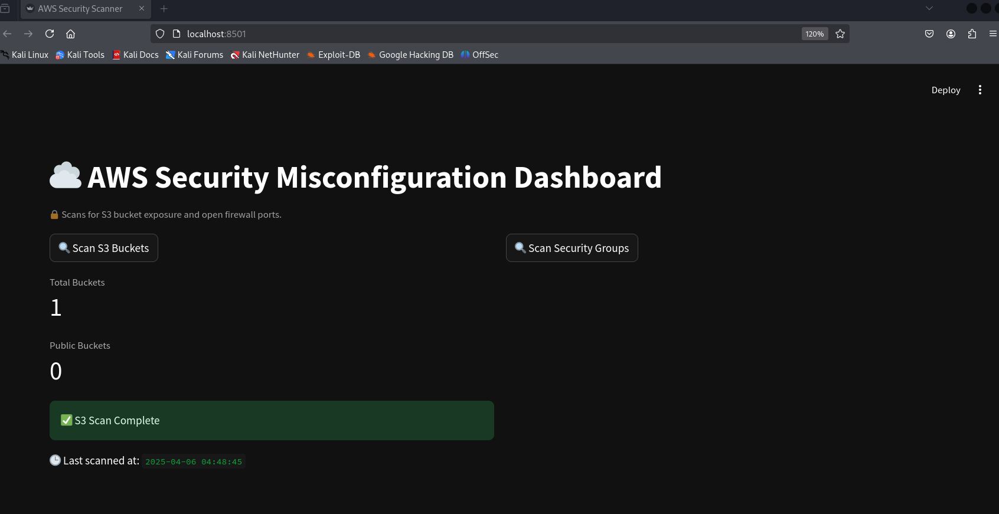
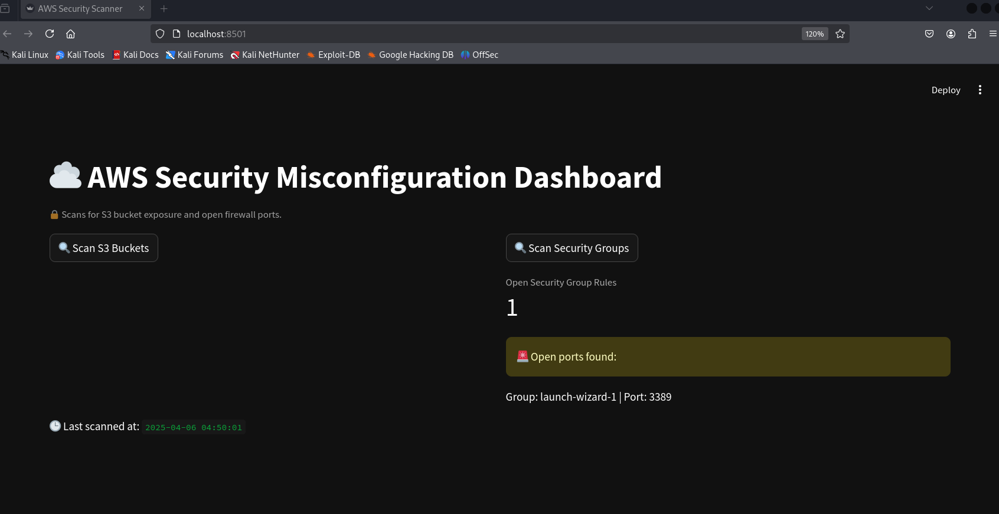

# ☁️ Cloud Misconfiguration Detection Tool (AWS)

A Python-based tool that scans your AWS cloud infrastructure for common misconfigurations like:

- 🚨 Public S3 buckets
- 🔓 Open security groups (firewall rules)
- 🔧 Auto-remediation for public S3 buckets
- 📊 Streamlit-powered dark-themed dashboard

## 📸 Preview

 

---



## 🛠️ Features

- Scans AWS for S3 and EC2 firewall misconfigurations
- Visual dashboard with scan metrics
- Dark theme UI using Streamlit
- Lightweight and fast

## 📦 Requirements

- Python 3.8+
- AWS credentials (set up via `aws configure`)
- Streamlit
- boto3

## 🚀 Installation

```bash
# Clone this repo
git clone https://github.com/your-username/cloud-misconfig-tool.git
cd cloud-misconfig-tool

# Create a virtual environment
python3 -m venv vcloud
source vcloud/bin/activate

# Install dependencies
pip install -r requirements.txt
